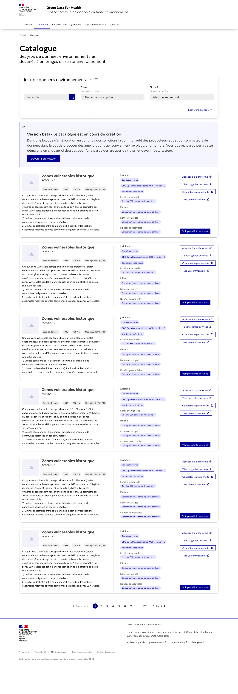

## Point d'entrée: liste des jeux de données /datasets
J'accède à la page jeux de données à l'adresse /datasets/:

### Commenter

Un bouton "commenter" est disponible. 
En cliquant sur le bouton une modale apparait avec un formulaire 
input text le nom de l'utilisateur
text-area : le texte du commentaire

EN cliquant sur le bouton valider:

POST /comments {"data": {"username": "", "text": "", "scope": "general"}}

un message d'information apparait à la place du formulaire "Votre commentaire a bien été enregistré!"
La modale se ferme après quelques secondes 

### Recherche
Je tape "métaux lourds" dans la barre de recherche:

et j'appuye sur entrée ou je clique sur le bouton "rechercher"

la langue sectionnée par défault est le français 'fr' 
> `POST api.gd4h.fr/search/datasets?lang=<selected_lang>`

### Resultats de la recherche

Le nombre de résultats s'affiche: X Jeux de données disponibles  
La recherche initiale est mentionnée: pour "contenu de la recherche initiale" 
La liste des jeux de données correspondant à la recherche s'affiche:
avec les même informations que la page qui liste tous les jeux de données:
- general_information:
  - title
  - acronym (if exists)
  - description
  - type
  - organismes producteur
- legal_information:
  - is_open_data
- geographical_information:
  - is geolocalized/geospatialized
- technical_information:
  - url 
- data information:
  - environment
  - nature
  - subtematic
  - exposure_factor_category
- lien vers la fiche jeux de données

+ **+ Des informations liées au contexte derecherche**:
- pour chaque dataset `{"highlights":[], "score": }`
  - match
  - score  
- un bouton "reset" apparaît pour effacer la recherche

### Recherche

Je selectionne un ou plusieurs filtres dans le menu de filtres. 

- A la sélection d'un filtre, les valeurs des filtres selectionnés + le texte de la recherche dans la barre de recherche 
la liste des résultats s'affiche

- Il est aussi possible d'appuyer sur Entrée ou de clicker sur le bouton rechercher pour accéder à la liste des résultats

### Resultats de la recherche

- Le nombre de résultats s'affiche: X Jeux de données disponibles  
- la recherche initiale est mentionnée: pour "requete" 
- les filtres selectionnés sont rappelés
- un bouton "reset" apparaît pour effacer la recherche
- la liste des jeux de données correspondant à la recherche s'affiche:
  - general_information:
    - title
    - acronym (if exists)
    - description
    - type
    - organismes producteur
  - legal_information:
    - is_open_data
  - geographical_information:
    - is geolocalized/geospatialized
  - technical_information:
    - url 
  - data information:
    - environment
    - nature
    - subtematic
    - exposure_factor_category
  - lien vers la fiche jeux de données
  - research_info:
    - match
    - score

## Point d'entrée: fiche de détail du jeu de données

J'accède à la page détaillée du jeux de données à l'adresse /datasets/<id>:

### Commenter le jeu de données

Un bouton "commenter" est disponible. 
En cliquant sur le bouton une modale apparait avec un formulaire 
input text le nom de l'utilisateur
text-area : le texte du commentaire

EN cliquant sur le bouton valider:

POST /comments {"data": {"username": "", "text": "", "scope": "dataset", "ref_id": <dataset.id>}}

un message d'information apparait à la place du formulaire "Votre commentaire a bien été enregistré!"
La modale se ferme après quelques secondes 

### Commenter une section du jeu de données

Un bouton "commenter" est disponible au niveau de chaque section. 
En cliquant sur le bouton une modale apparait avec un formulaire 
input text le nom de l'utilisateur
text-area : le texte du commentaire

EN cliquant sur le bouton valider:

POST /comments {"data": {"username": "", "text": "", "scope": "section", "ref_id": "<dataset.id>.<section_name>"}}

un message d'information apparait à la place du formulaire "Votre commentaire a bien été enregistré!"
La modale se ferme après quelques secondes.

### Commenter un champ descriptif du jeu de données

Un bouton "commenter" est disponible au niveau des valeurs qui acceptent les commentaires. 
En cliquant sur le bouton une modale apparait avec un formulaire 
input text le nom de l'utilisateur
text-area : le texte du commentaire

EN cliquant sur le bouton valider:

POST /comments {"data": {"username": "", "text": "", "scope": "value", "ref_id": "<dataset.id>.<section_name>.<field_key>"}}

un message d'information apparait à la place du formulaire "Votre commentaire a bien été enregistré! Il sera traité dans les meilleurs délais. Retrouver tous les commentaires sur /comments"
La modale se ferme après quelques secondes.

### ~Ajouter un tag~ [HORS SPECS]

Un bouton "+" est disponible au niveau du champs "exposure_factor/facteur". 
En cliquant sur le bouton une modale apparait avec un formulaire 
input text le nom de l'utilisateur
input text : le tag à proposer

EN cliquant sur le bouton valider:

POST /comments {"data": {"username": "", "text": "", "scope": "value", "ref_id": "<dataset.id>.<section_name>.<exposure_factor>"}}

un message d'information apparait à la place du formulaire "Votre suggestion a bien été enregistré! Elle sera traité dans les meilleurs délais. Retrouver tous les commentaires et suggestions sur /comments"
La modale se ferme après quelques secondes.